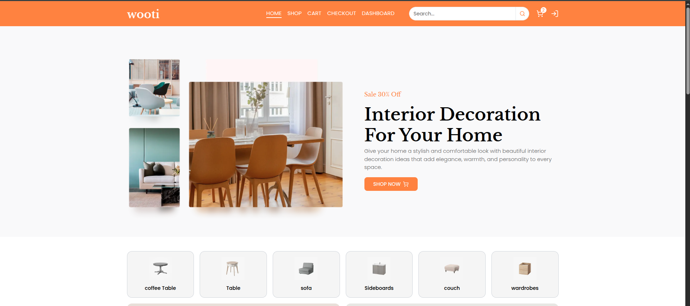
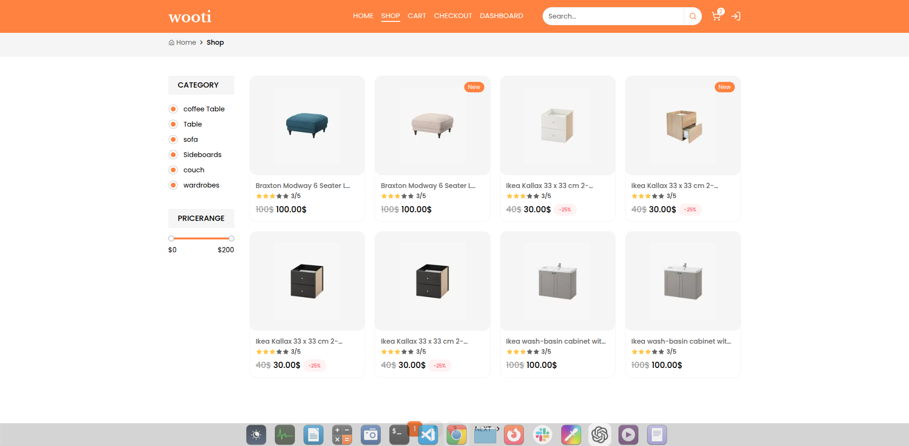
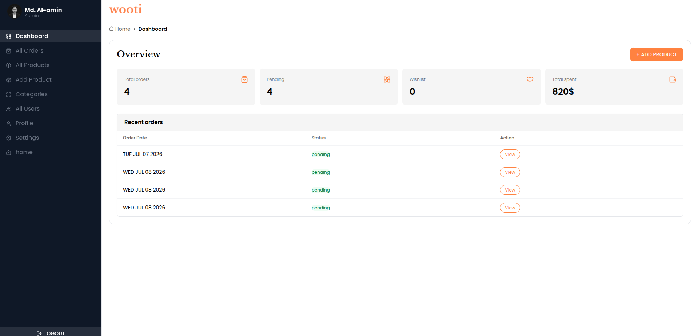
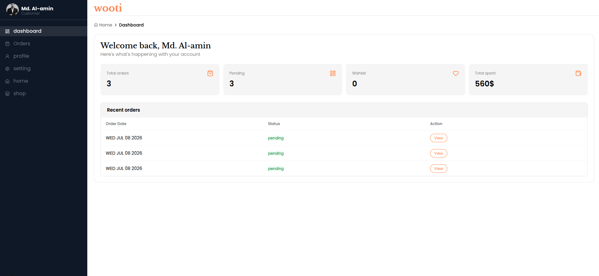

# Next Commerce — Full Stack E-Commerce

A modern full-stack e-commerce web application built with **Next.js App
Router**, **MongoDB**, **NextAuth**, **Stripe**, and **Cloudinary**. It delivers
a fast, secure, and responsive shopping experience with complete user and admin
functionality.


---

## Live Demo

**Live Preview:** https://your-project.vercel.app

---

## ✨ Features

### Authentication

- Email & Password Authentication
- Google OAuth Login
- Email OTP Verification
- Forgot Password
- Reset Password
- Protected Routes
- Role-based Authorization (User & Admin)

### Shopping

- Product Listing
- Product Search
- Category Filtering
- Product Details
- Shopping Cart
- Quantity Management
- Checkout
- Stripe Payment Gateway
- Order Success Page

### Order Management

- Place Orders
- Order History
- Single Order Details
- Order Status Tracking

### Admin Panel

- Dashboard Overview
- Product Management (CRUD)
- Category Management (CRUD)
- User Management
- Order Management
- Update Order Status

### Other Features

- Image Upload with Cloudinary
- REST API
- Server Actions
- Middleware Protection
- Responsive Design
- Toast Notifications
- SweetAlert2
- Form Validation
- Loading States
- Error Handling

---

## Tech Stack

| Frontend                | Backend & Services     |
| ----------------------- | ---------------------- |
| Next.js 16 (App Router) | Next.js Server Actions |
| React 19                | MongoDB                |
| Tailwind CSS            | Mongoose               |
| Shadcn/UI               | NextAuth               |
| React Hook Form         | Stripe                 |
| Lucide React            | Cloudinary             |
| Zod                     | Nodemailer             |
| SweetAlert2             | bcryptjs               |
| Axios                   | REST API               |
| React Icons             | Middleware             |

---

## Project Structure

```text
src/
├── actions/
│
├── app/
│   ├── (auth)/
│   │   ├── forgot-password/
│   │   ├── login/
│   │   ├── register/
│   │   ├── reset-password/
│   │   └── verification/
│   │
│   ├── (dashboard)/
│   │   ├── dashboard/
│   │   │   ├── orders/
│   │   │   │   └── [id]/
│   │   │   ├── profile/
│   │   │   └── setting/
│   │   │
│   │   └── admin/
│   │       ├── categories/
│   │       ├── products/
│   │       │   └── [id]/
│   │       ├── orders/
│   │       │   └── [id]/
│   │       ├── users/
│   │       ├── profile/
│   │       └── setting/
│   │
│   ├── (main)/
│   │   ├── cart/
│   │   ├── checkout/
│   │   ├── shop/
│   │   ├── success/
│   │   └── page.js
│   │
│   └── api/
│       ├── auth/
│       ├── order/
│       └── stripe/
│
├── components/
│   ├── Home/
│   ├── Layout/
│   ├── Shared/
│   └── UI/
│
├── contexts/
├── hooks/
├── libs/
├── middleware/
├── models/
├── providers/
├── utils/
└── middleware.js
```

---

## Getting Started

### Clone the Repository

```bash
git clone https://github.com/alamin-one/wooti.git
```

### Navigate to the Project

```bash
cd wooti
```

### Install Dependencies

```bash
npm install
```

### Run the Development Server

```bash
npm run dev
```

Open your browser and visit:

```
http://localhost:3000
```

---

## Environment Variables

Create a `.env.local` file in the project root.

```env
MONGO_URI=

NEXTAUTH_SECRET=
NEXTAUTH_URL=http://localhost:3000

GOOGLE_CLIENT_ID=
GOOGLE_CLIENT_SECRET=

EMAIL_USER=
EMAIL_PASS=

CLOUDINARY_PRESET_NAME=
CLOUDINARY_CLOUD_NAME=
CLOUDINARY_API_KEY=
CLOUDINARY_API_SECRET=

STRIPE_SECRET_KEY=
STRIPE_WEBHOOK_SECRET=
NEXT_PUBLIC_STRIPE_PUBLISHABLE_KEY=
```

---

## Screenshots

<table>
  <tr>
    <td></td>
    <td></td>
  </tr>
  <tr>
    <td></td>
    <td></td>
  </tr>
</table>
---

## Repository

https://github.com/alamin-one/wooti

---

## Developed By

**Al-Amin**

GitHub: https://github.com/alamin-one

---

## License

This project is licensed under the **MIT License**.

---

## Support

If you found this project helpful, consider giving it a on GitHub.
